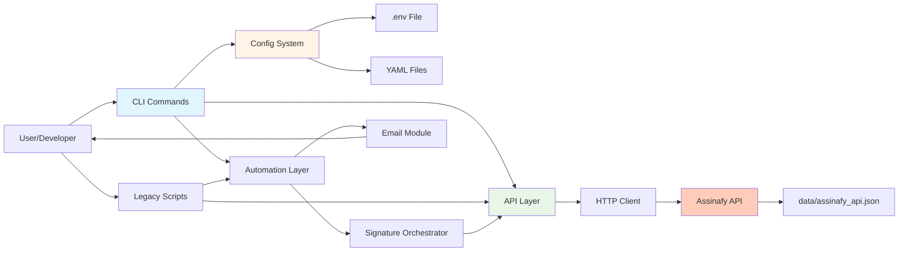
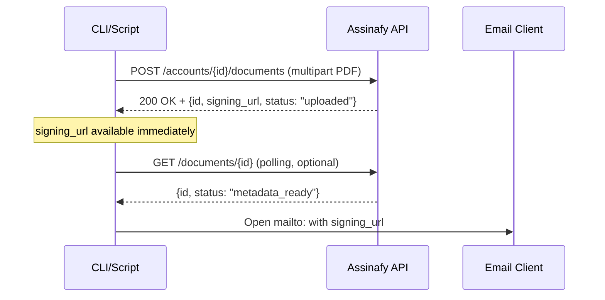

# Architecture Overview

This document serves as a critical, living template designed to equip agents with a rapid and comprehensive understanding of the codebase's architecture, enabling efficient navigation and effective contribution from day one. Update this document as the codebase evolves.

## 1. Project Structure

This section provides a high-level overview of the project's directory and file structure, categorised by architectural layer or major functional area.

```
[assinafy-scraper]/
├── assinafy/                  # Main package - Core business logic
│   ├── __init__.py
│   ├── cli.py                 # Click CLI entry point
│   ├── config.py              # Configuration system (YAML + env vars)
│   ├── logging_config.py      # Structured logging setup
│   ├── api/                   # API integration layer
│   │   ├── __init__.py
│   │   ├── client.py          # HTTP client with session management
│   │   └── documents.py       # Document operations (upload, get, wait)
│   └── automation/            # Automation workflows
│       ├── __init__.py
│       ├── signature.py       # Signature workflow orchestrator
│       └── email.py           # Email sending via mailto
├── tests/                     # Unit tests
│   ├── __init__.py
│   ├── conftest.py            # Shared fixtures
│   ├── test_cli.py            # CLI tests (8 tests)
│   ├── test_config.py         # Config tests (6 tests)
│   └── test_logging.py        # Logging tests (7 tests)
├── config/                    # Configuration templates
│   ├── default.yaml.example   # Default config template
│   └── custom.yaml            # Custom config (gitignored)
├── data/                      # Data files
│   └── assinafy_api.json      # Extracted API documentation (186KB)
├── docs/                      # Documentation
│   ├── arquitetura.md         # Detailed architecture (Portuguese)
│   ├── fluxo_documentos_assinafy.md
│   ├── migracao_cli.md        # Migration guide
│   └── resumo_fases_4_6.md    # Implementation summary
├── scripts/                   # Automation scripts
│   └── (placeholder)
├── assinafy_cli.py            # CLI executable wrapper
├── automatizar_assinatura.py  # Legacy script (compatibility)
├── test_upload_pdf.py         # Legacy script (compatibility)
├── enviar_link_assinatura.py  # Legacy script (compatibility)
├── test_e2e.py                # E2E tests (9 tests, validates real API)
├── pyproject.toml             # Project config, dependencies, scripts
├── .env.example               # Environment variables template
├── .gitignore                 # Ignore patterns
├── CLAUDE.md                  # Developer guide
├── README.md                  # Project overview
└── ARCHITECTURE.md            # This document
```

## 2. High-Level System Diagram



**Data Flow:**
1. User invokes CLI command or legacy script
2. Config loads from YAML → env vars → defaults (precedence)
3. Business logic executes (automation or API operations)
4. HTTP client communicates with Assinafy API
5. Results returned via CLI output or email client

## 3. Core Components

### 3.1. CLI Layer

**Name:** Assinafy CLI

**Description:** Modern command-line interface built with Click, providing unified access to all automation features. Supports three main commands: `automate` (full signature workflow), `upload` (PDF upload only), and `send-link` (send existing signing URL). Configurable verbosity (-v/-vv) and custom YAML configs.

**Technologies:**
- Python 3.9+
- Click 8.1+ (CLI framework)
- PyYAML 6.0+ (config parsing)

**Key Files:**
- `assinafy/cli.py` - Click command definitions
- `assinafy_cli.py` - Executable entry point

**Entry Point:** `assinafy = "assinafy.cli:cli"` (installed via `uv pip install -e .`)

### 3.2. Configuration System

**Name:** Multi-Source Configuration

**Description:** Centralized configuration system supporting three-tier precedence: environment variables (highest) → YAML files → hardcoded defaults (lowest). Ensures sensitive credentials (API keys) always come from `.env`, while non-sensitive settings can use YAML for customization.

**Technologies:**
- Python dataclasses
- PyYAML
- python-dotenv

**Key File:** `assinafy/config.py`

**Configuration Flow:**
```python
# Load order (highest to lowest priority):
1. os.getenv("ASSINAFY_API_KEY")           # Environment
2. yaml_config["assinafy"]["base_url"]     # YAML file
3. "https://api.assinafy.com.br/v1"        # Default
```

### 3.3. API Integration Layer

**Name:** Assinafy API Client

**Description:** HTTP client abstraction for Assinafy API with session management, connection pooling, and persistent headers. Handles multipart file uploads, JSON requests, and response parsing. Critical fix: omits `Content-Type` header from session to allow proper multipart boundary generation.

**Technologies:**
- requests 2.31+ (HTTP client)
- requests.Session (connection pooling)

**Key Files:**
- `assinafy/api/client.py` - Base HTTP client
- `assinafy/api/documents.py` - Document-specific operations

**Operations:**
- `upload_pdf(path, config)` - Upload PDF, return doc_id + signing_url
- `get_document(doc_id, config)` - Fetch document details
- `wait_for_ready(doc_id, config, timeout)` - Poll until ready for signing
- `list_documents(config)` - List all documents in workspace

### 3.4. Automation Workflows

**Name:** Signature Automation

**Description:** Orchestrates complete digital signature workflow: upload PDF → wait for processing → send signing URL via email. Uses structured logging throughout and gracefully handles processing timeouts (sends email even if document not fully processed).

**Technologies:**
- Python logging module
- webbrowser (mailto: links)

**Key Files:**
- `assinafy/automation/signature.py` - Workflow orchestrator
- `assinafy/automation/email.py` - Email composition

**Workflow:**
```python
def automate_signature(pdf_path, signer_email, config):
    # 1. Upload PDF
    result = upload_pdf(pdf_path, config)

    # 2. Wait for processing (optional, can timeout)
    wait_for_ready(result['id'], config, timeout=60)

    # 3. Send email with signing_url
    send_signing_email(
        document_id=result['id'],
        signing_url=result['signing_url'],
        signer_email=signer_email,
        config=config
    )
```

### 3.5. Logging System

**Name:** Structured Logging

**Description:** Centralized logging configuration with consistent format across all modules. Format: `[TIMESTAMP] LEVEL [module:line] message`. Supports console and file handlers, configurable levels (DEBUG/INFO/WARNING/ERROR/CRITICAL). Legacy scripts migrated from print statements to logger calls.

**Technologies:**
- Python logging module (stdlib)

**Key File:** `assinafy/logging_config.py`

**Usage Pattern:**
```python
from assinafy.logging_config import setup_logging, get_logger

logger = get_logger(__name__)
logger.info("Progress update")
logger.debug("Technical details")
logger.error("Error occurred")
```

### 3.6. Legacy Scripts (Compatibility)

**Name:** Legacy Automation Scripts

**Description:** Original scripts maintained for backward compatibility. All migrated to structured logging while preserving hardcoded parameter behavior. Fully functional but superseded by modern CLI.

**Key Files:**
- `automatizar_assinatura.py` - Full workflow (hardcoded params)
- `test_upload_pdf.py` - PDF upload test
- `enviar_link_assinatura.py` - Send existing signing URL

**Status:** Functional but deprecated for new use. Prefer CLI `assinafy` commands.

## 4. Data Stores

### 4.1. API Documentation Cache

**Name:** Extracted API Documentation

**Type:** JSON file (data/assinafy_api.json, 186KB)

**Purpose:** Cached documentation of Assinafy API extracted from static HTML. Contains 84 endpoints across 10 sections (Signer, Document, Template, Webhooks, etc.). Used for reference and query via jq.

**Key Structure:**
```json
{
  "base_url": "https://api.assinafy.com.br/v1",
  "extracted_at": "2026-03-24T21:48:09",
  "sections": [
    {
      "title": "Signer",
      "endpoints": [
        {
          "method": "GET",
          "path": "/accounts/{id}/signers",
          "parameters": []
        }
      ]
    }
  ]
}
```

### 4.2. Environment Configuration

**Name:** Credentials Store

**Type:** `.env` file (gitignored)

**Purpose:** Store sensitive credentials (API keys, workspace IDs). Loaded via python-dotenv. Never committed to git.

**Example (.env.example):**
```bash
ASSINAFY_API_KEY=your_api_key_here
ASSINAFY_WORKSPACE_ID=your_workspace_id_here
```

### 4.3. YAML Configuration

**Name:** Custom Settings Store

**Type:** YAML files in `config/` directory

**Purpose:** Store non-sensitive configuration (timeouts, URLs, logging levels). Optional override of defaults.

**Structure:**
```yaml
assinafy:
  base_url: "https://api.assinafy.com.br/v1"
  document_ready_timeout: 60
  polling_interval: 2
  log_level: "INFO"
```

## 5. External Integrations / APIs

### 5.1. Assinafy API

**Service Name:** Assinafy Digital Signature API

**Purpose:** Core service for digital signature automation. Handles document upload, processing, signing URL generation, and signature collection.

**Base URL:** `https://api.assinafy.com.br/v1`

**Integration Method:** REST API via HTTPS

**Authentication:** Header-based
```
X-Api-Key: <ASSINAFY_API_KEY>
Accept: application/json
```

**Key Endpoints:**
- `POST /accounts/{workspace_id}/documents` - Upload PDF (multipart/form-data)
- `GET /documents/{document_id}` - Get document details and status
- `GET /accounts/{workspace_id}/documents` - List all documents

**Critical Behavior:**
- `signing_url` returned immediately after upload (do not wait for processing)
- Document statuses: `uploading → uploaded → metadata_processing → metadata_ready → pending_signature → certificated`
- **Known Issue:** Documents often stuck in `uploaded` status, but `signing_url` still works

**Data Flow:**


## 6. Deployment & Infrastructure

### 6.1. Development Environment

**Runtime:** Python 3.9+ (tested on 3.14.3 - development release)

**Package Manager:** `uv` (modern Python package manager, faster than pip)

**Installation:**
```bash
# Clone repository
git clone <repo_url>
cd assinafy-scraper

# Install dependencies
uv sync

# Install CLI as system command
uv pip install -e .
```

**Environment Setup:**
```bash
# Copy environment template
cp .env.example .env

# Edit .env with credentials
# ASSINAFY_API_KEY=your_key
# ASSINAFY_WORKSPACE_ID=your_workspace_id
```

### 6.2. Code Quality Tools

**Linting:** `ruff` (fast Python linter)
```bash
.venv/bin/python -m ruff check assinafy/
```

**Formatting:** `black` (opinionated code formatter)
```bash
.venv/bin/python -m black assinafy/
```

**Configuration:** Line length 100, target Python 3.9+

### 6.3. Testing Infrastructure

**Framework:** `pytest` 7.4+

**Test Types:**
1. **Unit Tests** (21 tests, 33% coverage)
   - CLI commands: `tests/test_cli.py` (8 tests)
   - Config system: `tests/test_config.py` (6 tests)
   - Logging: `tests/test_logging.py` (7 tests)

2. **E2E Tests** (9 tests, 100% passing)
   - Real API validation: `test_e2e.py`
   - Tests: authentication, resource listing, pagination, search

**Run Tests:**
```bash
# Unit tests
.venv/bin/python -m pytest tests/ -v

# With coverage
.venv/bin/python -m pytest tests/ --cov=assinafy --cov-report=term-missing

# E2E tests (requires valid .env)
.venv/bin/python test_e2e.py
```

### 6.4. Deployment

**Type:** Local/CLI tool (no server deployment)

**Distribution:**
- Development: Run via `.venv/bin/python assinafy_cli.py`
- Installed: `uv pip install -e .` creates `assinafy` command
- Future: Potential PyPI package

**Dependencies:**
- Runtime: `requests>=2.31.0`, `python-dotenv>=1.0.0`, `click>=8.1.0`, `pyyaml>=6.0.0`
- Dev: `pytest>=7.4.0`, `pytest-cov>=4.1.0`, `black>=23.0.0`, `ruff>=0.1.0`

**CI/CD:** None configured (local development tool)

## 7. Security Considerations

### 7.1. Authentication

**Method:** API Key via HTTP Header

**Implementation:**
```python
headers = {
    "X-Api-Key": os.getenv("ASSINAFY_API_KEY"),
    "Accept": "application/json"
}
```

**Storage:** API keys stored in `.env` file (gitignored), never in code

### 7.2. Data Protection

**In Transit:** TLS/HTTPS for all API communications

**At Rest:** No persistent storage of sensitive data (credentials in .env only)

**Logging:** Sensitive data (API keys, tokens) never logged; document IDs and signing URLs considered non-sensitive

### 7.3. Input Validation

**File Upload:** PDF files validated by API (client-side validation minimal)

**Configuration:** Type validation via Python dataclasses for AssinafyConfig

**User Input:** CLI inputs validated by Click (type coercion, path existence checks)

### 7.4. Security Best Practices

- ✅ `.env` file in `.gitignore`
- ✅ `.env.example` provided (no real credentials)
- ✅ No hardcoded credentials in code
- ✅ API keys never logged
- ⚠️ No input sanitization for email content (mailto links trusted)
- ⚠️ No rate limiting (relies on API server-side limits)

## 8. Development & Testing Environment

### 8.1. Local Setup

**Prerequisites:**
- Python 3.9+
- `uv` package manager
- Assinafy API credentials

**Quick Start:**
```bash
# Clone and install
git clone <repo>
cd assinafy-scraper
uv sync

# Configure environment
cp .env.example .env
# Edit .env with credentials

# Run CLI
.venv/bin/python assinafy_cli.py --help

# Or install globally
uv pip install -e .
assinafy --help
```

### 8.2. Testing Workflow

**Unit Tests:** Fast, isolated, use mocked dependencies
```bash
.venv/bin/python -m pytest tests/ -v
```

**E2E Tests:** Slow, real API calls, require valid credentials
```bash
.venv/bin/python test_e2e.py
```

**Expected Results:**
- Unit: 21/21 passing
- E2E: 9/9 passing (100%)

### 8.3. Code Quality Standards

**Formatting:** `black` (line length 100)
```bash
.venv/bin/python -m black assinafy/
```

**Linting:** `ruff` (enforces style and catches errors)
```bash
.venv/bin/python -m ruff check assinafy/
```

**Standards:**
- Type hints in function signatures
- Docstrings for all public functions
- Logging over print statements
- Separation of concerns (CLI, business logic, data access)

## 9. Future Considerations / Roadmap

### 9.1. Short-Term (0-3 months)

- **Increase Test Coverage:** Target 80% coverage (currently 33%)
  - Add tests for `assinafy/api/documents.py`
  - Add tests for `assinafy/api/client.py`
  - Add tests for `assinafy/automation/*`

- **Error Handling:** Improve error messages and recovery
  - Validate PDF before upload
  - Better API error reporting
  - Retry logic for transient failures

### 9.2. Medium-Term (3-6 months)

- **Additional CLI Commands:**
  - `assinafy list` - List documents
  - `assinafy status DOC_ID` - Check document status
  - `assinafy download DOC_ID` - Download signed PDF

- **Configuration Enhancements:**
  - Multiple workspace profiles
  - Config validation on load
  - Environment-specific configs (dev/prod)

### 9.3. Long-Term (6-12 months)

- **Distribution:**
  - Publish to PyPI
  - GitHub Actions for CI/CD
  - Automated releases

- **Documentation:**
  - Sphinx-generated API docs
  - Video tutorials
  - Advanced usage examples

- **Architecture:**
  - Event-driven workflow for real-time status updates
  - Async HTTP client for concurrent operations
  - Plugin system for custom workflows

### 9.4. Known Limitations

- **Polling-Based:** Document status checked via polling (inefficient)
- **No Webhook Support:** API supports webhooks but not implemented
- **Email Only:** mailto:// links require user to manually send
- **Single Workspace:** Config assumes single workspace ID
- **No Batch Operations:** Can only upload one document at a time

## 10. Project Identification

**Project Name:** Assinafy Scraper & Automação

**Repository URL:** Local development (private)

**Primary Contact/Team:** ASOF - Gabriel Ramos

**Date of Last Update:** 2026-03-25

**Version:** 0.2.0

**License:** Internal use (ASOF)

## 11. Glossary / Acronyms

- **API Assinafy:** Brazilian digital signature service (https://assinafy.com.br)
- **Signing URL:** Unique URL where signers can access and sign documents (format: `https://app.assinafy.com.br/sign/{doc_id}`)
- **Workspace ID:** Unique identifier for an Assinafy account/organization
- **E2E Tests:** End-to-end tests (validate real API integration)
- **CLI:** Command-Line Interface
- **Multipart Upload:** HTTP file upload encoding (multipart/form-data)
- **Polling:** Repeatedly checking status until condition met
- **UV:** Modern Python package manager (faster alternative to pip)
- **Click:** Python CLI framework (decorator-based command definition)
- **Pydantic:** Data validation library (not currently used, replaced by dataclasses)

## Appendix: Key Architecture Decisions

### A1. Why Click Over argparse?

**Decision:** Use Click framework for CLI

**Rationale:**
- More elegant API (decorator-based)
- Better handling of files and paths
- Built-in help text generation
- Natural composition and subcommands
- Wider adoption in Python ecosystem

**Trade-off:** Additional dependency vs stdlib argparse

### A2. Why YAML Over JSON for Config?

**Decision:** Use YAML for configuration files

**Rationale:**
- More human-readable and writable
- Supports comments (JSON does not)
- Python-like syntax is familiar
- PyYAML is stable and mature

**Trade-off:** Slightly more complex parsing vs JSON

### A3. Why Separate Client from Document Operations?

**Decision:** Split into `client.py` and `documents.py`

**Rationale:**
- Single Responsibility Principle
- Client is reusable for other resources (signers, templates, etc.)
- Easier to test and mock
- Clear separation of HTTP mechanics vs business logic

**Trade-off:** More files vs single file

### A4. Why Dataclasses Over Pydantic?

**Decision:** Use stdlib dataclasses for config

**Rationale:**
- No additional dependency
- Sufficient for current needs
- Faster import time
- Type checking works with mypy/pyright

**Trade-off:** No runtime validation (Pydantic validates at runtime)

### A5. Why Maintain Legacy Scripts?

**Decision:** Keep old scripts functional with logging migration

**Rationale:**
- Backward compatibility for existing users
- Gradual migration path
- No breaking changes
- Legacy scripts still useful for quick tests

**Trade-off:** Maintenance burden vs clean break

---

**Document History:**
- v1.0 (2026-03-25): Initial architecture documentation
