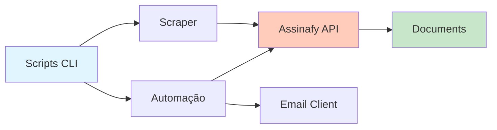

# Assinafy Scraper & Automação

Repositório para extração de documentação da API Assinafy e automação do fluxo de assinatura digital.

## 📋 Conteúdo

- **Documentação da API**: `data/assinafy_api.json` - 84 endpoints extraídos
- **Testes E2E**: `test_e2e.py` - Suíte de testes para validar funcionamento da API
- **Automação de Assinatura**: Scripts para upload e envio de documentos para assinatura
- **Documentação Técnica**: `docs/fluxo_documentos_assinafy.md` - Análise detalhada do fluxo

## 🚀 Automação de Assinatura Digital

### CLI Principal (Nova!)

**Instalação**:

```bash
# Instalar dependências
uv sync
```

**Comandos disponíveis**:

```bash
# Fluxo completo de automação
.venv/bin/python assinafy_cli.py automate documento.pdf --email user@example.com --name "User Name"

# Upload apenas
.venv/bin/python assinafy_cli.py upload documento.pdf

# Enviar link para documento existente
.venv/bin/python assinafy_cli.py send-link DOCUMENT_ID --email user@example.com

# Verbose (DEBUG logs)
.venv/bin/python assinafy_cli.py -vv automate documento.pdf -e user@example.com

# Com config customizado
.venv/bin/python assinafy_cli.py -c config/custom.yaml automate documento.pdf -e user@example.com
```

**Verbosidade**:
- Sem `-v`: WARNING (apenas erros)
- `-v`: INFO (progresso)
- `-vv`: DEBUG (detalhes técnicos)

### Scripts Legados

**⚠️ Scripts antigos ainda funcionam para compatibilidade, mas recomendamos usar a CLI:**

```bash
# Legado (parâmetros hardcoded)
.venv/bin/python automatizar_assinatura.py

# Legado
.venv/bin/python test_upload_pdf.py

# Legado
.venv/bin/python enviar_link_assinatura.py
```

### Configuração

**Arquivo `.env` (credenciais)**:

```bash
cp .env.example .env
# Edite .env com suas credenciais
```

**Arquivo YAML (configurações opcionais)**:

```bash
# Criar config customizado
cp config/default.yaml.example config/custom.yaml
# Edite custom.yaml conforme necessário
```

### Scripts Auxiliares

| Script | Propósito |
|--------|-----------|
| `test_upload_pdf.py` | Teste isolado de upload de PDF |
| `enviar_link_assinatura.py` | Enviar email com signing_url existente |
| `explore_signers.py` | Explorar estrutura de signatários na API |

**⚠️ `adicionar_signatarios.py` não funciona** - endpoint da API retorna 404

### Scripts Auxiliares

| Script | Propósito |
|--------|-----------|
| `test_upload_pdf.py` | Teste isolado de upload de PDF |
| `enviar_link_assinatura.py` | Enviar email com signing_url existente |
| `explore_signers.py` | Explorar estrutura de signatários na API |

**⚠️ `adicionar_signatarios.py` não funciona** - endpoint da API retorna 404

## 📖 Documentação da API

### Consultar Endpoints

```bash
# Listar seções
cat data/assinafy_api.json | jq '.sections[] | {title, endpoints: (.endpoints | length)}'

# Buscar endpoints específicos
cat data/assinafy_api.json | jq '.sections[].endpoints[] | select(.path | contains("signers"))'

# Ver detalhes de um endpoint
cat data/assinafy_api.json | jq '.sections[].endpoints[] | select(.method == "POST" and .path | contains("documents"))'
```

### Status de Documentos

```bash
.venv/bin/python -c "
import os, requests
from dotenv import load_dotenv
load_dotenv()

url = 'https://api.assinafy.com.br/v1/documents/statuses'
headers = {'X-Api-Key': os.getenv('ASSINAFY_API_KEY')}
response = requests.get(url, headers=headers)
print(response.text)
"
```

## 🧪 Testes E2E

### Executar

```bash
# Executar todos os testes
.venv/bin/python test_e2e.py

# Resultado esperado: 8/9 testes passando (88%)
```

### Testes Incluídos

- ✅ Autenticação com API Key
- ✅ Listagem de contas, documentos, signatários, templates, webhooks
- ✅ Validação de formato de resposta
- ✅ Busca full-text
- ❌ Paginação (falha esperada - workspace tem poucos documentos)

## ⚙️ Configuração

### Arquivo `.env`

Copie o arquivo de exemplo:

```bash
cp .env.example .env
# Edite .env com suas credenciais
```

### Headers de Autenticação

```
X-Api-Key: <ASSINAFY_API_KEY>
Content-Type: application/json
```

## 📚 Documentação Adicional

- **Fluxo de Documentos**: `docs/fluxo_documentos_assinafy.md` - Análise completa do processamento
- **CLAUDE.md**: Guia para desenvolvimento

## 🔍 Descobertas Importantes

### Status de Documentos

Os documentos passam por estes status:
```
uploading → uploaded → metadata_processing → metadata_ready → pending_signature → certificated
```

**Problema identificado**: Documentos ficam travados em `uploaded` após upload via API e não avançam para `metadata_processing`.

### Solução Recomendada

Usar `signing_url` imediatamente após upload, sem aguardar processamento:

```python
# Upload
response = requests.post(upload_url, files=files, headers=headers)
signing_url = response.json()['data']['signing_url']

# Enviar email (não aguardar processamento)
send_email(signing_url)
```

O `signing_url` está disponível imediatamente e a plataforma Assinafy lida com o processamento quando o signatário acessa o link.

### Formatos Suportados

| Formato | Status |
|---------|--------|
| PDF | ✅ Suportado |
| HTML | ❌ Não suportado |
| TXT | ❌ Não suportado |

## 📦 Dependências

**Runtime**:
- `requests>=2.31.0`
- `python-dotenv>=1.0.0`

**Desenvolvimento**:
- `pytest>=7.4.0`
- `black>=23.0.0`
- `ruff>=0.1.0`

## 📄 Licença

Este projeto é para uso interno da ASOF.

## 🏛️ Arquitetura

### Visão Geral



**Componentes principais**:
- **Scraper**: Extrai documentação da API (HTML → JSON)
- **Automação**: Upload PDF + envio de email
- **E2E Tests**: Suíte de testes para validar API

### Documentação Completa

Ver `docs/arquitetura.md` para:
- Diagramas detalhados de fluxo de dados
- Decisões de design e justificativas
- Limitações e restrições do sistema
- Interações entre componentes
