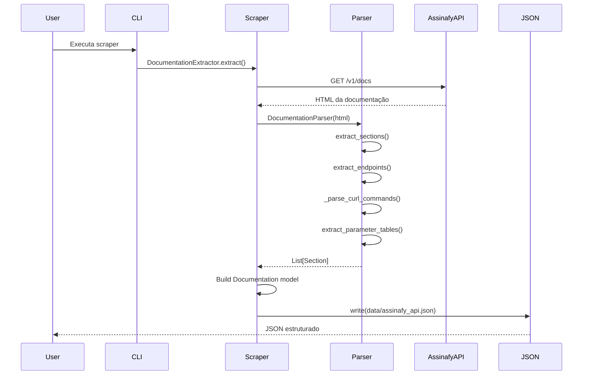
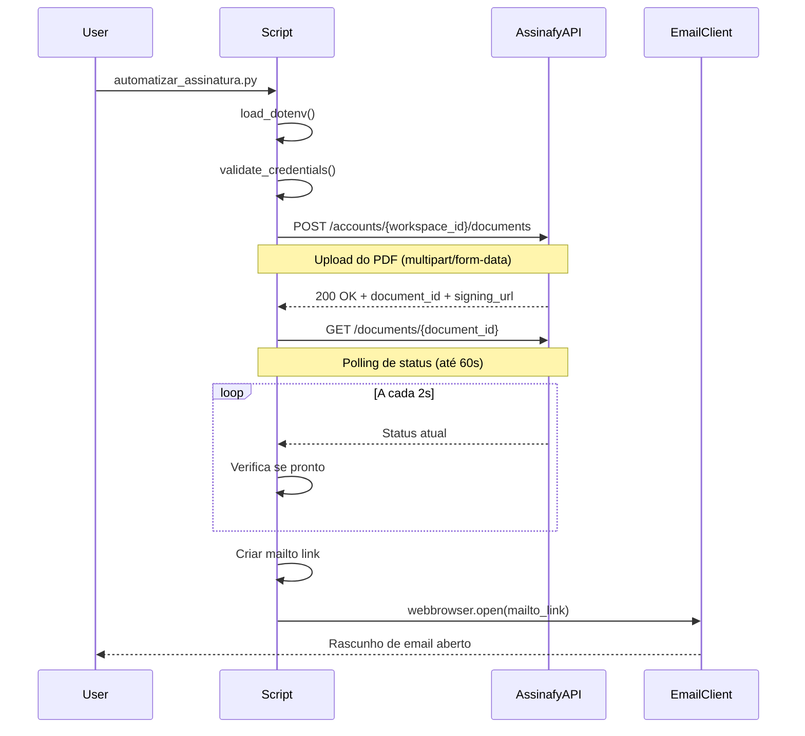
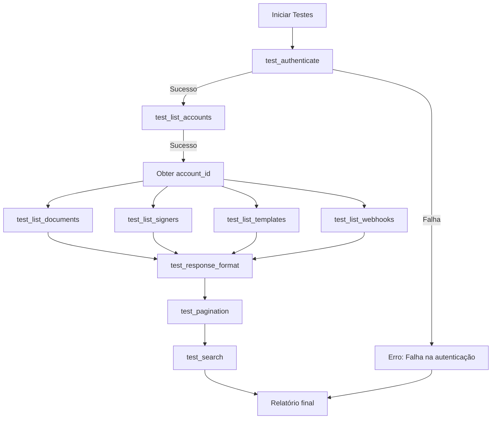
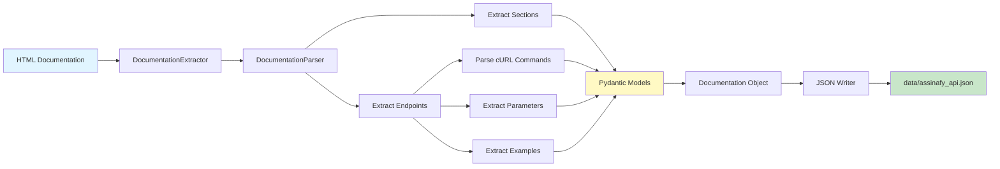
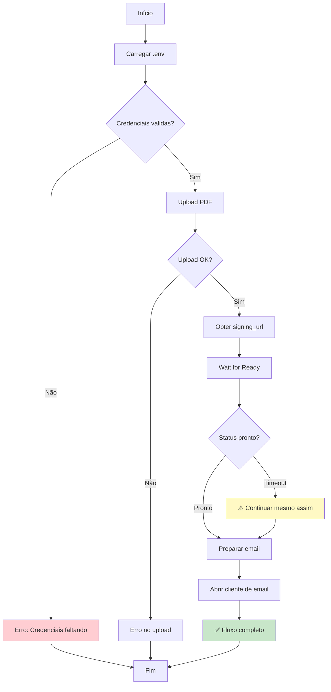
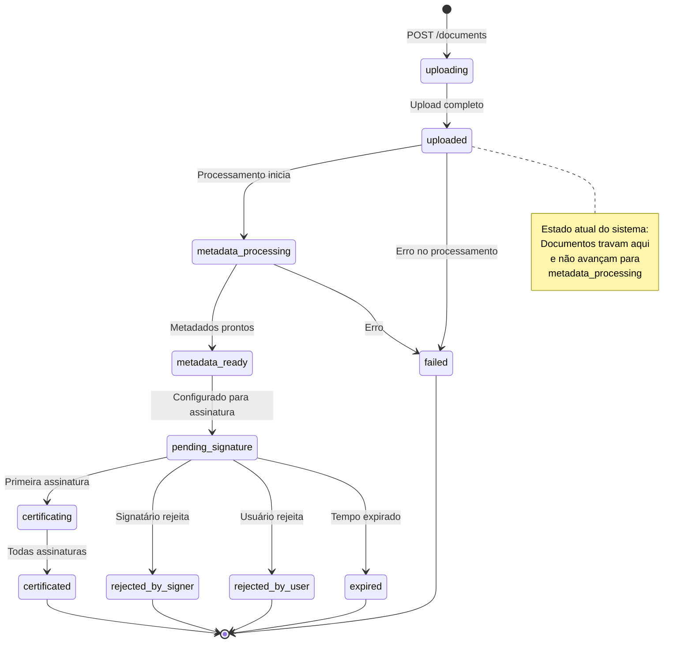
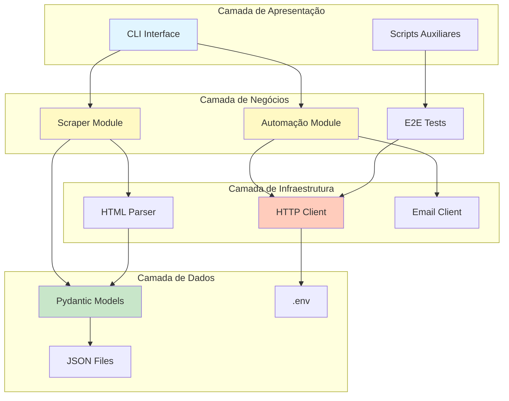

# Arquitetura do Sistema - Assinafy Scraper & Automação

**Versão**: 1.0
**Data**: 2026-03-25
**Autor**: Gabriel Ramos com Claude Code

---

## 1. Visão Geral de Alto Nível

### 1.1 Propósito

O sistema tem dois objetivos principais:

1. **Scraping da Documentação da API**: Extrair automaticamente a documentação da API Assinafy do HTML estático e gerar um JSON estruturado
2. **Automação de Assinatura Digital**: Automatizar o fluxo de upload de documentos e envio de links de assinatura via API Assinafy

### 1.2 Arquitetura Geral

```
┌─────────────────────────────────────────────────────────────┐
│                         CAMADA DE UI                         │
├─────────────────────────────────────────────────────────────┤
│  CLI (automatizar_assinatura.py)  │  Scripts de Teste      │
└──────────────┬───────────────────────────┬──────────────────┘
               │                           │
┌──────────────▼───────────────────────────▼──────────────────┐
│                    CAMADA DE LÓGICA                          │
├─────────────────────────────────────────────────────────────┤
│  Scraper       │  Automação        │  Testes E2E           │
│  - Extractor   │  - upload_pdf()   │  - AssinafyE2ETest    │
│  - Parser      │  - wait_ready()   │  - 9 test cases       │
│  - Models      │  - send_email()   │                       │
└──────────────┬───────────────────────────┬──────────────────┘
               │                           │
┌──────────────▼───────────────────────────▼──────────────────┐
│                 CAMADA DE DADOS                              │
├─────────────────────────────────────────────────────────────┤
│  data/assinafy_api.json  │  .env (credenciais)  │  PDFs    │
└─────────────────────────────────────────────────────────────┘
               │
┌──────────────▼──────────────────────────────────────────────┐
│                   SERVIÇOS EXTERNOS                          │
├─────────────────────────────────────────────────────────────┤
│  Assinafy API (https://api.assinafy.com.br/v1)             │
│  - Upload de documentos                                     │
│  - Consulta de status                                        │
│  - Obtenção de signing_url                                   │
└─────────────────────────────────────────────────────────────┘
```

### 1.3 Tecnologias

| Camada | Tecnologia | Propósito |
|--------|-----------|-----------|
| **HTTP Client** | `requests` | Comunicação com API Assinafy |
| **HTML Parsing** | `BeautifulSoup4` + `lxml` | Parse de documentação HTML |
| **Data Validation** | `Pydantic` | Models estruturados com validação |
| **Environment** | `python-dotenv` | Gestão de credenciais |
| **CLI** | `click` (futuro) | Interface de linha de comando |
| **Email** | `webbrowser` + `mailto:` | Abre cliente de email local |
| **Testing** | `pytest` (futuro) | Framework de testes |
| **Code Quality** | `black`, `ruff` | Formatação e linting |

---

## 2. Interações de Componentes

### 2.1 Fluxo de Scraping da Documentação



### 2.2 Fluxo de Automação de Assinatura



### 2.3 Fluxo de Testes E2E



---

## 3. Diagramas Mermaid de Fluxo de Dados

### 3.1 Pipeline de Scraping



### 3.2 Pipeline de Automação de Assinatura



### 3.3 Fluxo de Estados do Documento



### 3.4 Arquitetura de Componentes



---

## 4. Decisões de Design e Justificativa

### 4.1 BeautifulSoup ao Invés de Selenium/Playwright

**Decisão**: Usar `requests` + `BeautifulSoup` + `lxml` para scraping

**Justificativa**:
- ✅ A documentação da Assinafy é HTML estático (JavaScript não necessário)
- ✅ Mais rápido e leve (sem browser overhead)
- ✅ Mais confiável (sem problemas de rendering)
- ✅ Menos dependências externas
- ✅ Fácil de debugar (HTML visível diretamente)

**Trade-off**: Não funciona para sites com JavaScript pesado (SPA, React, etc.)

### 4.2 Pydantic Models para Validação

**Decisão**: Usar `Pydantic` com type hints estritos

**Justificativa**:
- ✅ Validação automática de tipos
- ✅ Documentação self-documenting
- ✅ Erros claros em caso de dados inválidos
- ✅ Fácil exportar para JSON/dict
- ✅ Integração com IDEs (autocompletion)

**Exemplo**:
```python
class Endpoint(BaseModel):
    title: str
    method: HTTPMethod  # GET, POST, PUT, DELETE
    path: str
    parameters: List[Parameter] = []
    requires_auth: bool = True

    def normalize_path(self) -> str:
        # Remove IDs reais e substitui por placeholders
        return re.sub(r'/[a-f0-9]{24,}', '/{id}', self.path)
```

### 4.3 Estrutura Modular com Separação de Responsabilidades

**Decisão**: Separar scraper, parser, models e output

**Justificativa**:
- ✅ **Single Responsibility**: Cada módulo faz uma coisa bem feita
- ✅ **Testabilidade**: Fácil testar componentes isoladamente
- ✅ **Manutenibilidade**: Mudanças em um componente não afetam outros
- ✅ **Reusabilidade**: Parser pode ser usado para outras APIs

**Estrutura**:
```
src/scraper/
├── models.py      # Pydantic models
├── parsers.py     # HTML parsing logic
├── extractor.py   # Orchestration
└── base.py        # HTTP client
```

### 4.4 Uso de mailto: em Vez de SMTP

**Decisão**: Usar `webbrowser.open(mailto:)` em vez de enviar emails via SMTP

**Justificativa**:
- ✅ **Simplicidade**: Não requer configuração de servidor SMTP
- ✅ **Segurança**: Credenciais de email não ficam no código
- ✅ **Controle do usuário**: Usuário revisa antes de enviar
- ✅ **Privacidade**: Email fica na caixa de envio do usuário

**Trade-off**: Requer intervenção manual do usuário para clicar em "Enviar"

### 4.5 Polling de Status com Timeout

**Decisão**: Implementar `wait_for_document_ready()` com polling a cada 2s e timeout de 60s

**Justificativa**:
- ✅ **Simplicidade**: Fácil de implementar e entender
- ✅ **Sem webhooks**: Assinafy não oferece webhooks para mudança de status
- ✅ **Limitado**: 60s é razoável para não travar o script

**Limitação conhecida**: Documentos travam em `uploaded` e nunca avançam para `metadata_processing`

### 4.6 Exception Handling Específico

**Decisão**: Capturar exceções específicas (`json.JSONDecodeError`, `FileNotFoundError`) em vez de `bare except`

**Justificativa**:
- ✅ **Debugging**: Erros não são engolidos silenciosamente
- ✅ **Logging**: Possível logar exceções específicas
- ✅ **Interrupção**: `KeyboardInterrupt` e `SystemExit` não são capturados

**Antes**:
```python
try:
    data = response.json()
except:
    data = {}
```

**Depois**:
```python
try:
    data = response.json()
except (json.JSONDecodeError, ValueError) as e:
    logger.warning(f"Failed to decode JSON: {e}")
    data = {}
```

### 4.7 Normalização de Paths com Placeholders

**Decisão**: Substituir IDs reais por placeholders (`{id}`, `{uuid}`)

**Justificativa**:
- ✅ **Generalização**: Endpoints ficam genéricos e reutilizáveis
- ✅ **Segurança**: IDs de documentos/sinais não ficam expostos
- ✅ **Documentação**: Mais fácil entender a estrutura da API

**Exemplo**:
```
Original:  /documents/10235a92bf785028b2dbc45653ba
Normalizado: /documents/{id}
```

### 4.8 Validação Early Fail

**Decisão**: Validar credenciais no início do script (`sys.exit(1)` se faltando)

**Justificativa**:
- ✅ **Fail-fast**: Erro é detectado antes de processamento
- ✅ **Clareza**: Mensagem de erro é explícita sobre o que falta
- ✅ **Economia**: Não desperdiça recursos com requisições que falharão

**Exemplo**:
```python
if not API_KEY or not WORKSPACE_ID:
    print("❌ Erro: Credenciais não encontradas no arquivo .env")
    sys.exit(1)
```

---

## 5. Restrições e Limitações do Sistema

### 5.1 Limitações da API Assinafy

| Problema | Impacto | Workaround |
|----------|---------|------------|
| **Documentos travam em `uploaded`** | Não avança para `metadata_processing` | Usar `signing_url` imediatamente |
| **Endpoint `/documents/{id}/signers` retorna 404** | Não é possível adicionar signatários via API | Configurar via interface web |
| **Sem webhooks** | Não há notificações de mudança de status | Polling manual ou verificação via UI |
| **Apenas PDF suportado** | HTML e TXT são rejeitados | Converter PDF antes ou usar existente |
| **Sem batch operations** | Cada documento precisa de upload individual | Loop sobre múltiplos arquivos |

### 5.2 Limitações do Sistema Atual

#### 5.2.1 Scripts de Teste

**Problemas**:
- ❌ Paths hardcoded (`PDF_FILE = "/Users/.../file.pdf"`)
- ❌ Credenciais hardcoded em alguns scripts
- ❌ Falta de testes unitários (apenas E2E)
- ❌ Bare `except` em alguns lugares (sendo corrigido)
- ❌ Falta de mocking para testes

**Impacto**: Dificuldade de rodar testes em outras máquinas/CI

**Melhorias planejadas**:
- [ ] Usar `pytest` com fixtures
- [ ] Mock de requests para testes offline
- [ ] Configuração via `pytest.ini`
- [ ] Relatório de cobertura (`pytest-cov`)

#### 5.2.2 Scripts de Automação

**Problemas**:
- ❌ Dados hardcoded no `__main__` (PDF_FILE, SIGNER_EMAIL)
- ❌ Falta de CLI com argparse
- ❌ Sem tratamento de interrupção (Ctrl+C)
- ❌ Sem logs estruturados

**Impacto**: Difícil reutilização por outros usuários

**Melhorias planejadas**:
- [ ] Adicionar `argparse` para CLI
- [ ] Config file JSON/YAML
- [ ] Logging com `logging` module
- [ ] Handler de sinais (SIGINT, SIGTERM)

#### 5.2.3 Scraper

**Problemas**:
- ❌ Específico para Assinafy (não genérico)
- ❌ Não detecta mudanças no HTML da documentação
- ❌ Sem cache ou incremental updates
- ❌ Falha silenciosamente se estrutura HTML mudar

**Impacto**: Quebra se Assinafy atualizar a documentação

**Melhorias planejadas**:
- [ ] Detecção de mudanças (hash do HTML)
- [ ] Cache local com timestamp
- [ ] Notificação de mudanças de estrutura
- [ ] Testes de sanidade pós-scraping

### 5.3 Limitações Técnicas

#### 5.3.1 Dependências

```python
# Runtime dependencies críticas
requests >= 2.31.0        # HTTP client
beautifulsoup4 >= 4.12.0  # HTML parsing
python-dotenv >= 1.0.0    # Environment management

# Python version requirement
Python >= 3.9             # Type hints (str | None syntax)
```

**Limitações**:
- `lxml` requer compilação C (pode falhar em alguns ambientes)
- Sem suporte para Python < 3.9 (type hints modernos)

#### 5.3.2 Performance

| Operação | Tempo | Limitação |
|----------|-------|------------|
| Scraping completo | ~5-10s | Network latency |
| Upload PDF (180KB) | ~2-5s | Upload speed |
| Polling status (60s) | até 60s | Timeout fixo |
| Parsing HTML | ~1s | CPU-bound |

**Gargalos**:
- Network latency para scraping
- Upload speed para PDFs grandes
- Polling ineficiente (sem webhooks)

#### 5.3.3 Segurança

**Riscos identificados**:
- ⚠️ API_KEY em texto plano no `.env`
- ⚠️ Sem encryptação de credenciais
- ⚠️ Emails expostos em código (sendo removido)
- ⚠️ Sem validação de SSL/TLS (herdado de requests)

**Mitigações**:
- ✅ `.env` no `.gitignore`
- ✅ `.env.example` como template
- ✅ Removendo dados hardcoded
- [ ] Keyring integration para credenciais

### 5.4 Limitações de Escalabilidade

| Aspecto | Limite Atual | Escalável? |
|---------|--------------|------------|
| Documentos por execução | 1 | ❌ (requer loop) |
| Signatários por documento | 1 (hardcoded) | ❌ (requer refatoração) |
| Tamanho do PDF | Não testado (>5MB) | ❓ |
| Concurrent requests | 1 (synchronous) | ❌ (requests síncronos) |
| Rate limiting | Desconhecido | ⚠️ (pode ser bloqueado) |

**Para escalar**:
- [ ] Async client (`aiohttp` ou `httpx`)
- [ ] Pool de conexões
- [ ] Rate limiting configurável
- [ ] Batch operations (se API suportar)

### 5.5 Limitações de Usabilidade

**Problemas atuais**:
- ❌ Sem UI/CLI intuitiva (apenas scripts Python)
- ❌ Mensagens de erro podem ser técnicas demais
- ❌ Sem wizard de configuração inicial
- ❌ Documentação esparsa (sendo melhorada)

**Melhorias planejadas**:
- [ ] CLI com `click` e subcomandos
- [ ] Config wizard interativo
- [ ] Melhores mensagens de erro
- [ ] Tutoriais e exemplos

---

## 6. Princípios de Design Aplicados

### 6.1 SOLID (Parcialmente)

| Princípio | Aplicação | Status |
|-----------|-----------|--------|
| **S**ingle Responsibility | Cada módulo tem uma responsabilidade | ✅ |
| **O**pen/Closed | Fácil estender models sem modificar | ⚠️ |
| **L**iskov Substitution | Models Pydantic seguem hierarquia | ✅ |
| **I**nterface Segregation | Funções pequenas e focadas | ✅ |
| **D**ependency Inversion | Depende de abstrações (requests) | ⚠️ |

### 6.2 DRY (Don't Repeat Yourself)

- ✅ Helper `_test_list_resource()` em testes
- ✅ Constants centralizadas (BASE_URL, etc.)
- ⚠️ Ainda há repetição em error handling

### 6.3 KISS (Keep It Simple, Stupid)

- ✅ Scripts simples e diretos
- ✅ Sem abstrações desnecessárias
- ✅ Código legível sem over-engineering

### 6.4 YAGNI (You Aren't Gonna Need It)

- ✅ Apenas funcionalidades necessárias
- ✅ Sem "features futuras"
- ⚠️ Algumas exceções genéricas demais

---

## 7. Evolução Futura

### 7.1 Curto Prazo (1-2 semanas)

- [ ] Completar correções do CodeRabbit (28 issues pendentes)
- [ ] Adicionar argparse aos scripts principais
- [ ] Melhorar error handling em todos os scripts
- [ ] Adicionar testes unitários

### 7.2 Médio Prazo (1-2 meses)

- [ ] CLI completa com `click`
- [ ] Sistema de config (JSON/YAML)
- [ ] Logging estruturado
- [ ] Integração com keyring

### 7.3 Longo Prazo (3-6 meses)

- [ ] Async client para concorrência
- [ ] Web UI simples (Streamlit?)
- [ ] Package PyPI distribuível
- [ ] Integração contínua (CI/CD)

---

## 8. Referências

### 8.1 Documentação

- **Assinafy API**: https://api.assinafy.com.br/v1/docs
- **Requests**: https://requests.readthedocs.io/
- **BeautifulSoup**: https://www.crummy.com/software/BeautifulSoup/bs4/doc/
- **Pydantic**: https://docs.pydantic.dev/

### 8.2 Padrões

- **REST API Design**: https://restfulapi.net/
- **Python Best Practices**: https://docs.python-guide.org/
- **Clean Code**: Robert C. Martin

### 8.3 Ferramentas

- **Markdown**: Para documentação
- **Mermaid**: Para diagramas
- **Git**: Controle de versão
- **GitHub**: Hospedagem e CI

---

**Fim do Documento de Arquitetura**
